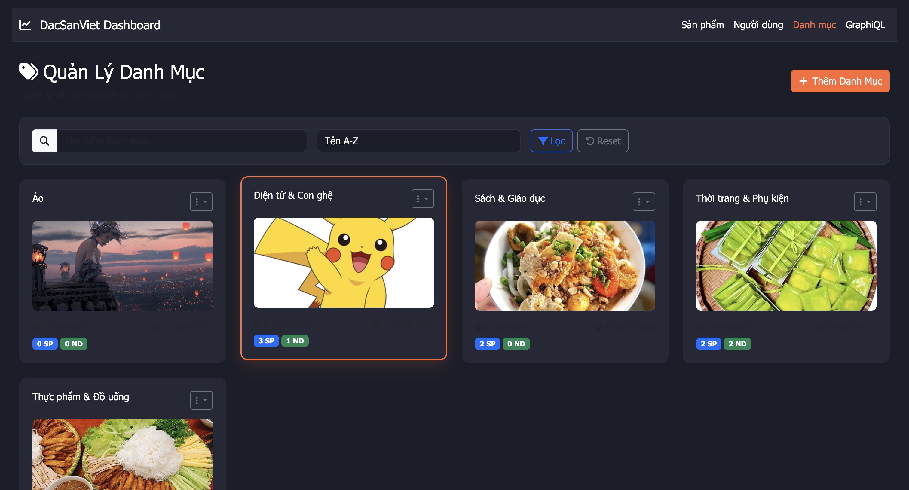
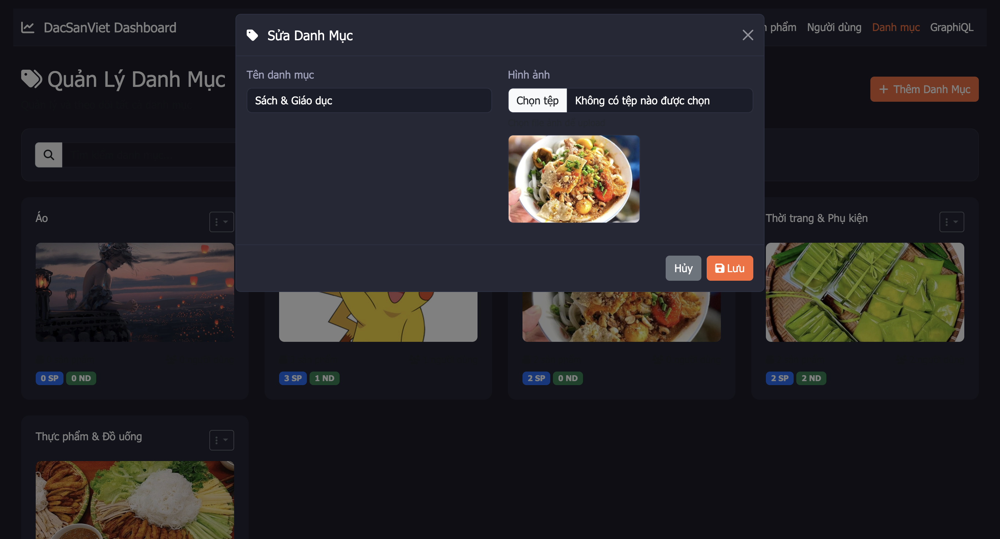
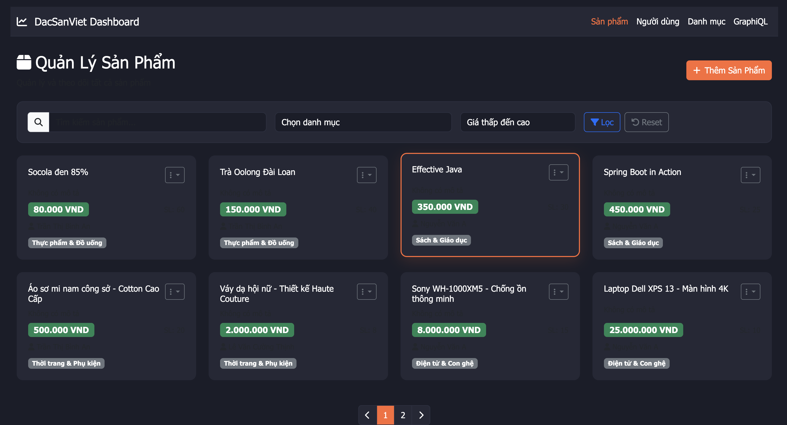
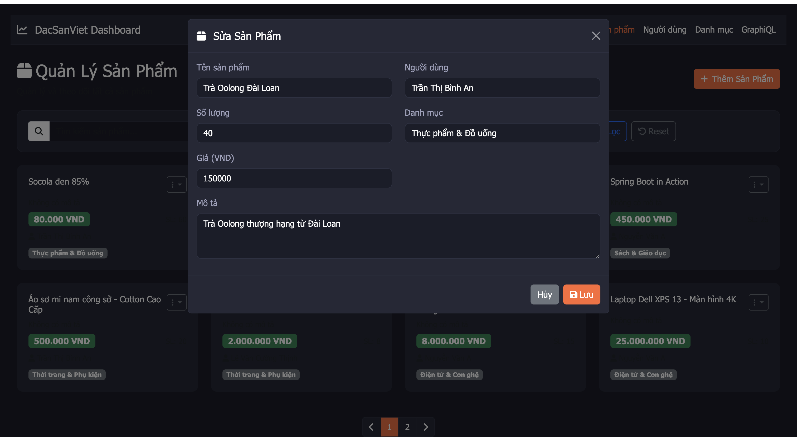
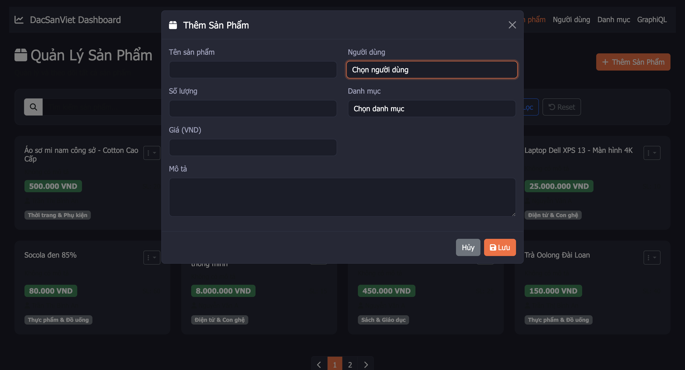
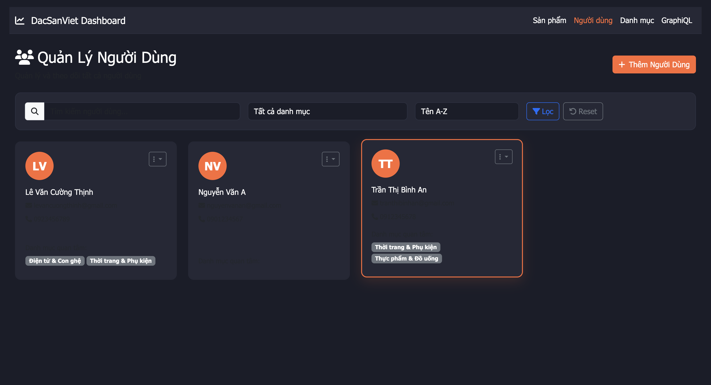

# 🌿 SpringBootWithGraphQL - Đặc Sản Việt

> **Spring Boot 5th Midterm Project**
> Ứng dụng quản lý Đặc Sản Việt sử dụng Spring Boot và GraphQL.


## 📖 Giới thiệu

Dự án này là bài tập môn Lập trình Web, xây dựng một hệ thống quản lý các đặc sản Việt Nam. Hệ thống cung cấp API GraphQL mạnh mẽ để truy vấn dữ liệu, tích hợp Spring Security để bảo mật, và giao diện quản trị sử dụng Thymeleaf.

## 🚀 Công nghệ sử dụng

*   **Core:** Java 21, Spring Boot 3.5.8
*   **Database:** SQL Server (Microsoft SQL Server)
*   **API:** Spring GraphQL
*   **Frontend (Admin):** Thymeleaf, HTML5, CSS3
*   **Security:** Spring Security
*   **Othes:** Lombok, Commons IO, Spring Mail

## 🛠️ Yêu cầu hệ thống

Trước khi bắt đầu, hãy đảm bảo bạn đã cài đặt:

*   [JDK 21](https://www.oracle.com/java/technologies/downloads/#java21)
*   [Maven](https://maven.apache.org/) (hoặc sử dụng `mvnw` có sẵn)
*   [SQL Server](https://www.microsoft.com/en-us/sql-server/sql-server-downloads)

## ⚙️ Cài đặt và Chạy ứng dụng

1.  **Clone repository:**
    ```bash
    git clone https://github.com/teehihi/dacsanviet-springboot-graphQL.git
    cd SpringBootWithGraphQL
    ```

2.  **Cấu hình cơ sở dữ liệu:**
    Mở file `src/main/resources/application.properties` và cập nhật thông tin kết nối SQL Server của bạn:
    ```properties
    spring.datasource.url=jdbc:sqlserver://localhost:1433;databaseName=DacSanVietGraphQL;...
    spring.datasource.username=sa
    spring.datasource.password=your_password
    ```
    *Lưu ý: Đảm bảo database `DacSanVietGraphQL` đã được tạo hoặc để Hibernate tự động tạo (ddl-auto=update).*

3.  **Chạy ứng dụng:**
    ```bash
    ./mvnw spring-boot:run
    ```

## 🔌 Sử dụng

Sau khi ứng dụng khởi động thành công:

*   **Trang chủ:** Truy cập [http://localhost:8088](http://localhost:8088)
*   **GraphiQL Explorer:** Truy cập [http://localhost:8088/graphiql](http://localhost:8088/graphiql) để thử nghiệm các truy vấn GraphQL.

### Cấu hình Port
Mặc định ứng dụng chạy trên port `8088`. Bạn có thể thay đổi trong `application.properties`:
```properties
server.port=8088
```

## 📁 Cấu trúc dự án

```
SpringBootWithGraphQL/
├── src/
│   ├── main/
│   │   ├── java/           # Source code Java
│   │   ├── resources/      # Config, templates, static files, i18n
│   │   │   ├── graphql/    # Các file schema .graphqls
│   │   │   ├── templates/  # Thymeleaf views
│   │   │   └── i18n/       # Tài nguyên đa ngôn ngữ
├── uploads/                # Thư mục lưu trữ file upload
├── pom.xml                 # Maven dependencies
└── README.md               # File này
```

## Demo Giao Diện

### Giao diện Trang Chủ


*Trang chủ hệ thống được hiển thị 1 cách trực quan, dễ dàng tìm kiếm sản phẩm, danh mục, người dùng thông qua thanh tìm kiếm và các tab khác nhau.*
### Giao diện Danh Mục




*Giao diện quản lý danh mục và thêm sửa xoá được xử lý ảnh với Multipart file upload*

### Giao diện Sản Phẩm




*Giao diện thêm sửa xoá, hiển thị sản phẩm được áp dụng ajax không load trang*

### Giao diện Quản lý Người Dùng


*Giao diện chỉnh sửa và thêm người dùng tương tự sản phẩm*

## 🧪 Demo & Hướng Dẫn GraphQL

### 🔍 QUERIES (Truy vấn dữ liệu)

#### 1. Hiển thị tất cả sản phẩm sắp xếp theo giá từ thấp đến cao
```graphql
query {
  getProductsSortedByPrice {
    id
    title
    price
    quantity
    desc
    user {
      id
      fullname
      email
    }
    category {
      id
      name
    }
  }
}
```

#### 2. Lấy tất cả sản phẩm của một danh mục (ví dụ: categoryId = "1")
```graphql
query {
  getProductsByCategory(categoryId: "1") {
    id
    title
    price
    quantity
    user {
      fullname
    }
    category {
      name
    }
  }
}
```

#### 3. Lấy tất cả sản phẩm
```graphql
query {
  getAllProducts {
    id
    title
    price
    quantity
    desc
    user {
      id
      fullname
    }
    category {
      id
      name
    }
  }
}
```

#### 4. Lấy một sản phẩm theo ID
```graphql
query {
  getProduct(id: "1") {
    id
    title
    price
    quantity
    desc
    user {
      fullname
      email
    }
    category {
      name
    }
  }
}
```

#### 5. Lấy tất cả người dùng với danh mục và sản phẩm
```graphql
query {
  getAllUsers {
    id
    fullname
    email
    phone
    categories {
      id
      name
    }
    products {
      id
      title
      price
    }
  }
}
```

#### 6. Lấy tất cả danh mục với người dùng và sản phẩm
```graphql
query {
  getAllCategories {
    id
    name
    images
    users {
      id
      fullname
    }
    products {
      id
      title
      price
    }
  }
}
```

### ✏️ MUTATIONS (Thay đổi dữ liệu)

#### 1. Tạo danh mục mới
```graphql
mutation {
  createCategory(input: {
    name: "Đồ chơi"
    images: "https://example.com/toys.jpg"
  }) {
    id
    name
    images
  }
}
```

#### 2. Tạo người dùng mới với danh mục quan tâm
```graphql
mutation {
  createUser(input: {
    fullname: "Phạm Thị Dung"
    email: "dung@example.com"
    password: "password123"
    phone: "0934567890"
    categoryIds: ["1", "2"]
  }) {
    id
    fullname
    email
    categories {
      name
    }
  }
}
```

#### 3. Tạo sản phẩm mới
```graphql
mutation {
  createProduct(input: {
    title: "MacBook Pro M3"
    quantity: 5
    desc: "Laptop Apple mới nhất với chip M3"
    price: 45000000
    userId: "1"
    categoryId: "1"
  }) {
    id
    title
    price
    user {
      fullname
    }
    category {
      name
    }
  }
}
```

#### 4. Cập nhật sản phẩm
```graphql
mutation {
  updateProduct(id: "1", input: {
    title: "Laptop Dell XPS 13 - Updated"
    quantity: 12
    desc: "Laptop cao cấp với hiệu năng mạnh mẽ - Phiên bản cập nhật"
    price: 24000000
    userId: "1"
    categoryId: "1"
  }) {
    id
    title
    price
    quantity
  }
}
```

#### 5. Cập nhật người dùng
```graphql
mutation {
  updateUser(id: "1", input: {
    fullname: "Nguyễn Văn An - Updated"
    email: "an.updated@example.com"
    password: "newpassword123"
    phone: "0901234567"
    categoryIds: ["1", "3"]
  }) {
    id
    fullname
    email
    categories {
      name
    }
  }
}
```

#### 6. Xóa sản phẩm
```graphql
mutation {
  deleteProduct(id: "10")
}
```

#### 7. Xóa người dùng
```graphql
mutation {
  deleteUser(id: "4")
}
```

#### 8. Xóa danh mục
```graphql
mutation {
  deleteCategory(id: "5")
}
```

### 🧪 Test Cases quan hệ Many-to-Many

#### Kiểm tra User có nhiều Categories
```graphql
query {
  getUser(id: "1") {
    id
    fullname
    categories {
      id
      name
    }
  }
}
```

#### Kiểm tra Category có nhiều Users
```graphql
query {
  getCategory(id: "1") {
    id
    name
    users {
      id
      fullname
    }
  }
}
```

### ✅ Checklist hoàn thành:

- [x] GraphQL Schema với đầy đủ Query và Mutation
- [x] Mối quan hệ Many-to-Many giữa User và Category
- [x] Mối quan hệ One-to-Many giữa User-Product và Category-Product
- [x] CRUD operations cho tất cả entities
- [x] Query sắp xếp sản phẩm theo giá
- [x] Query lọc sản phẩm theo danh mục
- [x] Sample data initialization
- [x] Web interface với AJAX
- [x] GraphiQL interface enabled

## 👤 Tác giả

**Nguyễn Nhật Thiên (TEE)**
- 📧 Email: teeforwork21@gmail.com
- 🔗 GitHub: [github.com/teehihi](github.com/teehihi)
- 🌐 Linktree: [linktr.ee/nkqt.tee](linktr.ee/nkqt.tee)

---
*Made with ❤️ for Web Programming Course*
